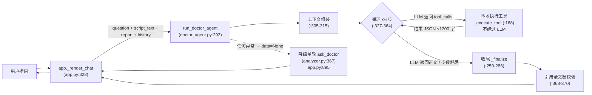
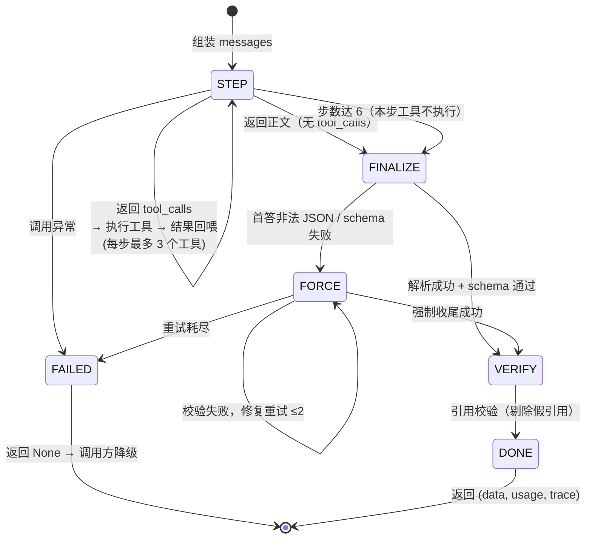

# 剧本医生 Agent（对话层）设计文档

> 生成日期：2026-09-15 ｜ 只讲对话层这一个 Agent，其余架构见 ARCHITECTURE_SUMMARY.md
> 核心文件：doctor_agent.py（390 行，Agent 全部逻辑）｜ 接入：app.py:828 `_render_chat` ｜ LLM 适配：llm.py:106 `complete_with_tools`
> 标注约定：**事实**（代码存在）与**建议**（可扩展性讨论）分开。

---

## 1. 一句话设计

**用户每问一个问题，模型在最多 6 步内自主调用 3 个只读工具查证剧本原文与报告，最后输出结构化回答；回答里的每条引用经全文逐字校验，编造的被剔除；整个流程失败则自动降级到单轮问答。**

设计目标（按优先级）：
1. **可信**：引用真实可验，查不到就明说「没有」（防幻觉是对话层的生死线）
2. **可用**：任何故障下对话功能不消失（降级兜底）
3. **可控**：每问成本有上限（步数、工具数、结果长度三重封顶）

---

## 2. 架构总览



两条主路径：**正常查证路径**（循环 → 收尾 → 校验）与**降级路径**（异常 → 单轮）。设计上降级路径永远存在——它是「对话功能不消失」的保证。

---

## 3. 上下文组装（每问一次，doctor_agent.py:305-315）

| 组成 | 内容 | 来源 |
|---|---|---|
| system | `SYSTEM_BASE`（产品角色）+ `MODULE_SYSTEM_ADDON["chat"]`（回答格式）+ `AGENT_SYSTEM_ADDON`（**工具使用规则 5 条**） | prompts.py:600 / :613 / doctor_agent.py:93-105 |
| 剧本上下文 | ≤2 万字：全文；更长：场头概览（细节靠工具按需取） | `chat_context_text` analyzer.py:337 |
| 报告摘要 | 报告核心结论压缩版 | `report_digest` analyzer.py:308 |
| 历史 | 最近 10 条对话（无则「（无）」） | `CHAT_MAX_HISTORY=10` analyzer.py:305 |
| 提问 | 用户原文 | — |

**AGENT_SYSTEM_ADDON 的 5 条工具规则**（doctor_agent.py:96-104）是这个 Agent 的行为宪法：
1. 涉及具体台词/情节的问题必须先查证；引用必须逐字抄自工具返回
2. **工具返回中找不到的内容一律视为不存在**，明确回答「剧本中无相关信息」，confidence 降为 0.3
3. 查证步数有限：不重复查询同一内容
4. 不再需要查证时直接输出最终 JSON
5. 引用的 scene 必须来自工具返回，text 必须逐字摘自工具返回（≤40 字）

---

## 4. 主循环状态机（doctor_agent.py:327-364）



关键设计点：

| 设计点 | 实现 | 位置 |
|---|---|---|
| 步数上限 | `MAX_AGENT_STEPS=6`；第 6 步即使返回 tool_calls 也**不执行、直接收尾**——保证「必有回答」 | doctor_agent.py:23、:339-342 |
| 每步工具数上限 | 只执行前 3 个 tool_calls，防止单步调用爆炸 | `MAX_TOOLS_PER_TURN=3` doctor_agent.py:25 |
| 结果截断 | 工具结果回喂前 `json.dumps(...)[:1200]`，控制输入成本 | doctor_agent.py:26、:363 |
| 消息回写 | assistant 消息保留完整 tool_calls 结构（含 id/type/function），tool 消息带 tool_call_id——符合 OpenAI 协议，模型可关联 | doctor_agent.py:344-364 |
| 异常即降级 | 单步调用异常不重试（控成本），直接返回 None | doctor_agent.py:329-332 |

---

## 5. 工具契约（3 个只读工具）

| 工具 | 输入 | 输出 | 约束 |
|---|---|---|---|
| `search_script` | `keyword: str` | `{"found","hits":[{"scene","title","excerpt"}],"note"}` | 最多 6 条命中；每条带 ±40 字上下文；空关键词返回提示；无命中返回「全文未找到」（doctor_agent.py:117-144） |
| `get_scene` | `scene: int` | 该场全文（title + content） | 场次不存在返回含 error 的结果；>1200 字截断（doctor_agent.py:147-152、:179-187） |
| `read_report_section` | `section: enum 白名单` | 报告章节 JSON（截断 1200 字） | **枚举白名单** 11 个章节名，防止任意键读取（doctor_agent.py:39-42、:155-165）；章节缺失返回 found=False |

**失败处理原则**：工具不抛异常——参数非法 / 未知工具 / 场次不存在都返回**含 error 字段的 dict 回喂给模型**（doctor_agent.py:168-191），模型可以换参数再查。错误是对话的一部分，不是流程的中断。

**为什么全部本地执行**：工具返回的每个字都来自 `scenes` / `report` 的本地检索，**不经过 LLM 生成**——模型收到的信息天然真实，这是引用校验闭环的前提（详见 §7）。

---

## 6. 收尾机制（_finalize，doctor_agent.py:250-286）

收尾是 Agent 里最容易被忽视、但最决定可靠性的一段：

1. **优先免一次调用**：循环里模型已给出的正文（`first_attempt`）先尝试解析 + schema 校验，通过就直接用（省 1 次调用）
2. **非法则强制收尾**：追加 `FORCE_SUFFIX`（doctor_agent.py:107-110），用 `client.complete` 的 **json_object 模式、不带工具**强制输出最终 JSON——`complete_with_tools` 的对话历史被 `_user_text` 压成纯文本重放（doctor_agent.py:231-247，json_object 模式不支持 tools 消息，必须转文本）
3. **修复重试 ≤2**：校验失败时把错误信息追加进 prompt 再试（doctor_agent.py:284），与管道侧 `_run_module` 同口径
4. **重试耗尽 → None**：降级单轮

**为什么收尾要用 json_object 而不是继续带工具**：带工具模式下模型可能继续调工具、永远不收束；json_object 强制输出 JSON 结构，把「收束」变成模式约束而不是请求。

---

## 7. 引用校验：防幻觉的闭环（doctor_agent.py:366-371）

```
模型输出 evidence_quotes
        ↓
对全文做 re.sub(r"\s+","",script_text) 去空白
        ↓
每条 quote.text 逐字子串匹配（_filter_quotes analyzer.py:241）
        ↓
不匹配 → 剔除该引用 + 记 warning；答案保留
```

**闭环为什么成立**（三个环节缺一不可）：
1. 工具只读 + 本地执行 → 模型见过的原文都是真的
2. prompt 约束「text 必须逐字抄自工具返回」→ 模型有合法获取逐字原文的途径
3. 校验对**全文**做 → 即使长剧本基础上下文只是场头概览，模型经 get_scene 取到原文后，引用照样能通过全文校验（这是 agent 相对单轮的决定性升级）

**校验只验 text，不验 scene 场次号**——这是已知盲点，评估方案里用「同一短语种到 2 场」的语料来检测（EVALUATION_PLAN.md BC-2）。

---

## 8. 失败处理总表（每一类故障的用户感知）

| 故障 | 处理 | 用户看到什么 | 位置 |
|---|---|---|---|
| 单步 LLM 调用异常 | 返回 None → 降级单轮 | 正常回答 + note「[剧本医生Agent] 异常，降级单轮」 | doctor_agent.py:329-332；app.py:895 |
| 首答不是合法 JSON | 改用强制收尾 | 正常回答（多 1 次调用） | doctor_agent.py:262-264 |
| 收尾 schema 校验失败 | 修复重试 ≤2 | 正常回答（多 1-2 次调用） | doctor_agent.py:280-284 |
| 修复重试耗尽 | 返回 None → 降级单轮 | 正常回答 + 降级 note | doctor_agent.py:285 |
| 工具参数非法 / 未知工具 / 场次不存在 | 含 error 结果回喂，循环继续 | 模型换参数再查（trace 显示「失败：…」） | doctor_agent.py:168-191 |
| 关键词无命中 | 返回「全文未找到」 | 模型应答「剧本中无相关信息」confidence 0.3 | doctor_agent.py:141-142、:98-99 |
| 引用对不上原文 | 剔除该引用 + warning | 回答保留，假引用消失 | doctor_agent.py:368-370 |
| 步数耗尽 | 强制收尾 | 正常回答 + warning「已达最大步数」 | doctor_agent.py:339-342 |

**设计原则**：所有故障的终点都是「用户得到回答」——要么经修复，要么经降级。对话功能本身永不因 Agent 故障而不可用。

---

## 9. 与单轮 ask_doctor 的差异

| 维度 | 单轮 `ask_doctor`（analyzer.py:367） | Agent（doctor_agent.py:293） |
|---|---|---|
| 调用次数 | 固定 1 次 | 2–7 次（1-6 步循环 + 1 收尾） |
| 查证能力 | 无——只能凭上下文记忆 | 3 工具自主查证 |
| 引用校验范围 | 对上下文文本校验（长剧本 = 场头概览，**模型没见过的原文引不出来**） | 对全文校验（模型经工具取原文后可引用任意场次） |
| 「无信息」处理 | 凭记忆判断，可能编 | 工具无命中 = 硬证据，规则强制拒答 confidence 0.3 |
| 成本 | $/问 ×1 | $/问 ×2~6（预估口径 ×3，doctor_agent.py:29） |
| 适用问题 | 报告摘要类（「报告说了什么」） | 原文核实类（「台词在哪场」「这漏洞成立吗」） |

**两者是保留关系不是替换关系**：agent 失败降级到单轮；评估方案预期「摘要类问题单轮就够」→ 下一步做问题分类路由（EVALUATION_PLAN §4.3）。

---

## 10. UI 集成（app.py:828-910）

| 环节 | 实现 |
|---|---|
| 提问入口 | `st.chat_input` → `run_doctor_agent`，包裹在 `st.status("剧本医生查证中…")` 中（app.py:885） |
| 步骤实时展示 | 每个工具执行后回调 `step_cb`（doctor_agent.py:358-359），用户展开 status 可见「搜索原文 · 命中 N 条」逐步出现 |
| 步骤持久化 | trace 存入聊天记录，历史消息下渲染「✓ 已查证 · 搜索原文 · 命中 N 条」（app.py:864，_TRACE_ICONS app.py:821） |
| 成本 | 提问前显示单问预估（×3 步口径）+「agent 模式」标注；回答后按实际 usage 累计「已调用 N 次」（app.py:846、:907-911） |
| 降级 | except 捕获 → `analyzer.ask_doctor` → note 说明（app.py:895） |

---

## 11. 测试覆盖（tests/test_agent_chat.py，46 项断言 → 设计点映射）

| 测试用例 | 钉住的设计点 |
|---|---|
| 用例 0（工具单元 8 断言） | 工具契约：命中/无命中/空关键词/场次越界/章节白名单/未知工具/UI 标签 |
| 用例 1（多轮循环） | 查证 → 回喂 → 引用校验全链路；trace 记录；usage 累计 |
| 用例 2（假引用剔除） | 防幻觉闭环：未命中全文的引用被剔除、答案保留、warning 记录 |
| 用例 3（步数上限） | 6 步全是工具调用 → 强制收尾；5 步执行工具 + 1 收尾 = 7 次调用 |
| 用例 4（首答非法） | 收尾机制：非法 JSON → 强制收尾修复 |
| 用例 5（schema 修复重试） | 修复重试 ≤2 成功路径 |
| 用例 6（异常 → None） | 降级触发条件 |
| 用例 7（参数非法回喂） | 工具错误是对话的一部分、循环不中断 |
| 用例 8（成本预估） | ×3 步口径 = 单轮 × AGENT_EST_STEPS |
| 用例 9（AppTest 集成） | UI 层：trace 渲染、调用计数、降级 note 展示 |

---

## 12. 已知边界（面试被问「还有什么问题」时的诚实清单）

1. **判断不受校验保护**：引用被逐字校验，但模型对节奏/情感/逻辑的**判断**（如「这场节奏拖沓」）没有硬兜底——只有置信度锚点（0.3/0.5/0.7/0.9）和「参考意见」声明
2. **场次号不校验**：quote.text 通过但 scene 标错会穿透（评估 BC-2，改进方案已列：用 search 定位真实场次并比对）
3. **截断误读**：>1200 字的工具结果被截断，模型可能基于半截信息答错（评估 BC-3）
4. **长剧本概览误判**：>2 万字时模型可能不调工具、凭场头概览误答（评估 BC-6）
5. **成本高**：每问 2~6 次调用，摘要类问题性价比低于单轮（→ 路由优化）
6. **上下文丢失**：对话只存会话内、刷新即失；历史报告因未存全文不能对话
7. **步数/乘数/阈值是拍的**：6 步、×3 预估、2 万字阈值——已列入评估校准计划（DECISIONS.md 最不确定的三个决策）

---

## 13. 可扩展性（建议，未实现）

| 想做的事 | 改动点 | 代价 |
|---|---|---|
| 加第 4 个工具 | `TOOLS` 列表 + `_execute_tool` 分支 + `TOOL_LABELS` 标签 + AGENT_SYSTEM_ADDON 规则 | 保持只读；写工具会凿穿引用校验闭环 |
| 调步数上限 | 一个常量 `MAX_AGENT_STEPS` | 先采集真实步数分布再调（校准计划） |
| 问题分类路由 | `_render_chat` 前加分类判断：摘要类 → ask_doctor，核实类 → agent | 分类本身要一次调用或规则匹配，省的是 2~6 次 |
| 引用场次校验 | `_filter_quotes` 后加「search 定位真实场次比对 scene 字段」 | 每次校验多一次本地搜索，0 LLM 成本 |
| 引用宽松匹配二档 | 校验失败后做编辑距离比对，通过则标「近似引用」 | 误杀率下降，但「近似」标注要上新 UI |
| 对话持久化 | chat_history 写库 + 历史报告补存全文 | 存储成本 + 隐私考虑 |
| 多轮规划（先列查证清单再查） | system prompt 加「第 1 步先规划」指令 | 步数利用率提升，首步不查证可能让简单问题多 1 步 |

---

## 14. 面试速览（每个设计点一句话）

1. **Agent 定义**：控制流由模型决定（tool_calls 循环）——对照管道是硬编码（doctor_agent.py:327 vs analyzer.py:658）
2. **只读工具**：防幻觉闭环的承重墙——工具返回不经 LLM、写工具会让模型「改完引用自己的改动」
3. **6 步上限**：成本封顶 + 第 6 步强制收尾保证必有回答；数字是拍的、校准计划已列
4. **收尾机制**：json_object 强制收束 + schema 修复重试 ≤2——把「收束」变成模式约束而不是请求
5. **引用校验**：全文去空白逐字匹配；对不上就剔除、答案保留——宁可错杀不可漏放
6. **「无信息」规则**：工具查不到 = 硬证据，强制「剧本中无相关信息」confidence 0.3——拒答不是失败，是功能
7. **降级**：任何异常 → 单轮 ask_doctor + note——对话功能永不消失
8. **成本透明**：先预估（×3 步）后按实际累计——预估是承诺，累计是对账
9. **测试**：46 项断言用 FakeAgentClient 打桩，10 个用例每个钉住一个设计点
10. **诚实边界**：判断不校验、场次号不校验、截断误读、长剧本概览误判——四个盲点全部有归因方法和改进方向（EVALUATION_PLAN BC-1/2/3/6）
