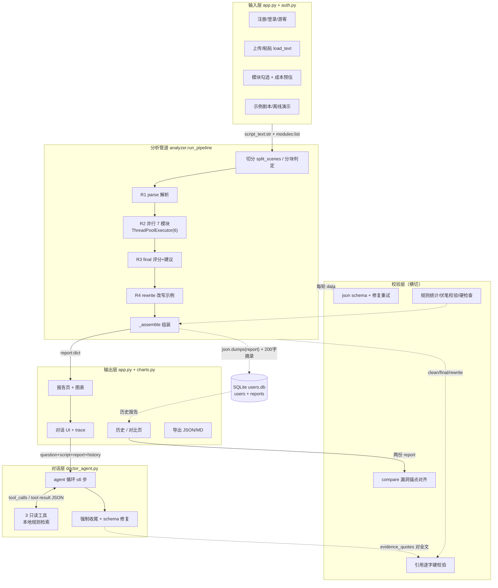
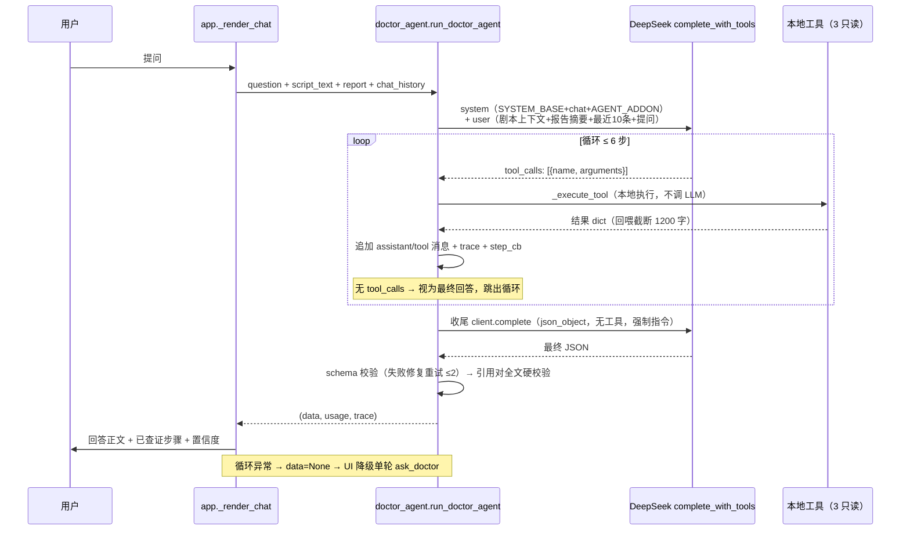

# Script Doctor 产品架构与功能地图

> 生成日期：2026-09-15 ｜ 代码版本：Stage 3「剧本医生 Agent 化」完成后（全部 8 个测试套件通过）
> 说明：你给的背景里写「对话层（Agent）：正在改造中」——**该改造已于 2026-09-15 完成并落地**（`doctor_agent.py` 新增、`llm.py` 增加 function calling 适配、报告页对话区已接入）。本文档按**当前已实现状态**撰写，每个结论附代码位置。

---

## 0. 一句话架构判断

**分析管道是确定性 Workflow（控制流硬编码），对话层是 Agent（控制流由模型决定），校验层横切两者，存储层是我在你给出的 5 层之外补的第 6 层。**

| 层 | 控制流由谁决定 | 证据 |
|---|---|---|
| 分析管道 | **代码**：R1→R2→R3→R4 顺序硬编码在 `run_pipeline()` | analyzer.py:658（顺序写死在函数体，无工具调用分支） |
| 对话层 | **模型**：LLM 返回 `tool_calls` 与否决定查证/回答 | doctor_agent.py:327-338（循环读取 `msg.get("tool_calls")` 分支） |

为什么这样切：管道求**可控**（成本可预估、每轮可独立校验、模块可并行）；对话求**灵活**（问题不可预枚举，需要模型自己决定查什么）。代价对调：管道改流程要改代码，agent 每问多次调用、成本不可精确预估（用估算口径 × 平均步数，doctor_agent.py:374-389）。

---

## 1. 功能地图（按用户使用流程）

用户完整路径：**登录/注册 → 上传配置 → 分析中 → 看报告 → 追问 → 历史/对比**。

### 阶段 A：进入与登录

| 功能名 | 所属层 | 解决什么问题 | 输入 | 输出 | 自动/需确认 |
|---|---|---|---|---|---|
| 注册 / 登录 | 输入层 + 存储层 | 用户系统与数据归属 | 用户名 + 密码 | 登录态（会话内 `user_id`） | 自动（点击即注册并登录，auth.py:59） |
| 密码安全 | 存储层 | 密码不落明文 | 明文密码 | PBKDF2-SHA256 加盐哈希（20 万次迭代，auth.py:39-43） | 自动 |
| 游客体验 | 输入层 | 无账号快速演示 | 点击「游客体验」 | 游客态（`is_guest=True`，只能离线演示） | 自动（app.py:434 `_enter_main`；在线分析按钮禁用 app.py:621、646） |
| 主题切换 | 输出层 | 浅色/深色视觉偏好 | ⋮ → Settings → Theme | 全局 UI + 图表换色（charts.py:91 `get_palette` 按主题取色） | 需确认（用户主动操作） |

### 阶段 B：上传与配置

| 功能名 | 所属层 | 解决什么问题 | 输入 | 输出 | 自动/需确认 |
|---|---|---|---|---|---|
| 上传 / 粘贴剧本 | 输入层 | 多格式文本进入系统 | txt / pdf / docx 文件或粘贴文本 | `script_text: str`（全文） | 自动（load_text analyzer.py:135；PDF 无文本层报错 analyzer.py:143-144） |
| 编码探测 | 输入层 | 中文剧本 GBK 乱码 | 文件字节流 | 解码后文本（先试 UTF-8 再试 GB18030，analyzer.py:152-160） | 自动 |
| 模块勾选 | 输入层 | 成本与范围控制 | 7 个 AI 模块勾选集合（默认全选） | `modules: list`；**全不勾 = 纯免费硬检查（0 次 LLM 调用）** | 需确认（app.py:581-595；0 模块分支 analyzer.py:695-721） |
| 成本预估 | 输入层 | 消费前可见预期 | `script_text` + `modules` | 预估调用次数 + 费用（分缓存命中/闲时/高峰三档） | 自动（estimate_run_cost analyzer.py:65） |
| 示例剧本 | 输入层 | 无 API Key 也能演示 | 点击标签页 | `demo_script.txt`（273 字 / 4 场） | 需确认（app.py:416 `load_offline_demo`） |
| 改稿对比模式 | 输入层 | 改稿闭环：带上一版建议重新分析 | 选择上一版历史报告 | `prev_suggestions: list` 注入 R3 | 需确认（app.py:569-579 → start_analysis app.py:407 → `_build_review_block` analyzer.py:107） |

### 阶段 C：分析中

| 功能名 | 所属层 | 解决什么问题 | 输入 | 输出 | 自动/需确认 |
|---|---|---|---|---|---|
| 进度展示 | 输出层 | 70–140 秒长任务的过程可见 | `progress_cb(fraction, label)` | 进度条 + 阶段文字（①解析 ②并行 x/7 ③评分 ④改写） | 自动（app.py:658-676 → progress 回调 analyzer.py:682-684） |
| 4 轮 10 调用管线 | 分析管道 | 把大任务拆成可并行、可校验的小步 | `script_text` | `report: dict`（完整报告 JSON） | 自动（run_pipeline analyzer.py:658） |
| 场次切分 | 分析管道 | 剧本结构化 | 全文 | `scenes: [{"n","title","content"}]` | 自动（split_scenes analyzer.py:171；SCENE_RE analyzer.py:168；无场头时按空行退化 analyzer.py:201-203） |
| 分块模式 | 分析管道 | >2 万字超长剧本 | 全文（>20000 字，CHUNK_THRESHOLD_CHARS analyzer.py:31） | 场头概览 → 每 8-12 场一块（重叠 1 场）→ 汇总合并 | 自动（analyzer.py:688 判定 → `_run_chunked` analyzer.py:529 → MERGE_TEMPLATE prompts.py:843） |
| 模块级降级 | 校验层 | 单模块失败不拖垮整次分析 | 失败模块输出 | 空值 + 警告，报告照常产出 | 自动（`_run_module` 修复重试 ≤2 后降级，analyzer.py:268-298） |

### 阶段 D：报告查看

| 功能名 | 所属层 | 解决什么问题 | 输入 | 输出 | 自动/需确认 |
|---|---|---|---|---|---|
| 评分卡 + 6 维雷达 | 输出层 | 一屏看懂总分与短板 | `report["score"]` | 评分卡（呼吸光晕动效）+ 雷达图 | 自动（app.py:963 → charts.py:119 `score_radar`） |
| 角色分布 / 情感曲线 / 节奏张力 / 关系网络 | 输出层 | 把 JSON 变可读图表 | 各模块 JSON | 柱状图 / 最多 3 线折线 / 张力图 / 力导向网络图 | 自动（charts.py:156/207/229/304） |
| 结构体检（三幕图 + 伏笔清单 + 人物弧光） | 输出层 + 校验层 | 结构维度可视化 | `report["structure"]` | 三幕色带图 + 伏笔回收清单（回收场次 ≥ 埋点场次**规则校验**，不靠 LLM） | 自动（charts.py:229 → `_validate_structure` analyzer.py:495） |
| 漏洞列表 + 修改建议 + 改写片段 | 输出层 | 可落笔的改稿动作 | `logic` / `suggestions` / `rewrite` | 每条建议配「逐字引用原文 + 改写后片段 + 理由」 | 自动（第 4 轮独立调用，analyzer.py:794-818） |
| 规则硬检查 | 输出层 + 校验层 | 0 成本的可信数据 | 全文 + 场次 | 对白占比、每场字数分布、页数↔时长换算（600 字/页 ≈ 1 分钟）；<5000 字只出统计跳过判定 | 自动（本地计算不调 LLM，hardcheck.py:42；阈值 hardcheck.py:14-19） |
| 离线演示 v1↔v2 切换 | 输出层 | 无 Key 演示完整改稿闭环 | 点击切换 | `demo_report.json` / `demo_report_v2.json` 预计算报告 | 需确认（app.py:966-984；闭环指标 78/100、+10、漏洞 2→0、采纳 3/3 为**演示硬编码**，见 §7 待确认） |
| 导出 JSON / Markdown | 输出层 | 报告带走 | `report` dict | 下载文件（report_to_markdown app.py:1280） | 需确认 |

### 阶段 E：对话追问（剧本医生 Agent）

| 功能名 | 所属层 | 解决什么问题 | 输入 | 输出 | 自动/需确认 |
|---|---|---|---|---|---|
| 多轮查证回答 | 对话层 | 单轮回答不可信 → 先查原文再答 | 提问 + 剧本 + 报告 + 最近 10 条对话 | `{"answer","evidence_quotes","confidence"}` | 自动（run_doctor_agent doctor_agent.py:293；上限 6 步 doctor_agent.py:23） |
| 3 个只读工具 | 对话层 | 给模型检索能力但不给写能力 | 模型自主决定调用 | search_script / get_scene / read_report_section，**全部本地规则检索、不经过 LLM 生成**（杜绝编造工具返回） | 自动（TOOLS 定义 doctor_agent.py:44-91；实现 :117-191） |
| 查证步骤实时展示 | 对话层 | 让用户看见 agent「在想什么」 | `step_cb` 回调 | `st.status` 展开的「搜索原文 · 命中 3 条」等步骤 + 对话区持久 trace | 自动（app.py:885 `st.status`；trace 渲染 app.py:864） |
| 引用全文硬校验 | 校验层 | 防幻觉 | `evidence_quotes` + 剧本全文 | 逐字对不上的引用**剔除** + 警告（agent 模式对全文校验，长剧本不受场头概览限制） | 自动（doctor_agent.py:368-370 → `_filter_quotes` analyzer.py:241） |
| 异常降级单轮 | 对话层 | agent 挂了体验不崩 | 循环内异常 / 收尾失败 | 降级到 `ask_doctor` 单轮回答 + note 说明 | 自动（doctor_agent.py:326-332 返回 None → app.py:895 兜底） |
| 成本累计 | 对话层 | 实际用量透明 | 每问 `usage` | 「已调用 N 次」会话累计（先显示单问预估 ≈3 步，后按实际累计） | 自动（app.py:846 预估 + chat_usage 累计） |

### 阶段 F：历史与对比

| 功能名 | 所属层 | 解决什么问题 | 输入 | 输出 | 自动/需确认 |
|---|---|---|---|---|---|
| 报告入库 | 存储层 | 分析结果留存 | `report` dict | `users.db` reports 表（完整 report_json + 仅 200 字剧本摘录） | 自动（history.py:50 save_report；EXCERPT_CHARS=200 history.py:17） |
| 历史列表 / 打开 | 输出层 + 存储层 | 找回过往报告 | 用户 id | 报告列表（LIMIT 100，history.py:18）/ 打开完整报告 | 需确认（history.py:81 list_reports / :105 get_report → 渲染 app.py:1453） |
| 改稿前后对比 | 输出层 + 校验层 | 量化改稿效果 | 任选两条历史报告 | 总分变化 / 分项雷达 / 漏洞修复对照 / 采纳判定 | 需确认（app.py:1604；compare.py:28 match_holes **纯规则**、不调 LLM，对齐状态 open/gone/unknown/new_in_v2） |
| 建议采纳判定 | 校验层 | 建议是否真的落实 | 上一版 suggestions + 新版剧本 | 每条 adopted 真/假；**未采纳必须写明「还差哪一步」**（analyzer.py:126，`_build_review_block` 注入 R3 的约束） | 自动（分析时注入，analyzer.py:774） |

---

## 2. 系统架构图

### 2.1 分层总览

### 2.2 Agent 循环细节（对话层内部）

### 2.3 跨层交互：数据格式与失败处理

| # | 交互 | 数据形态 | 失败处理 | 代码位置 |
|---|---|---|---|---|
| 1 | 输入层 → 分析管道 | `script_text: str`；`prev_suggestions: list`（可空）；`modules: list`；`progress_cb: callable` | `run_pipeline` 内不捕获异常，冒泡到 running 页 → 显示错误页 + 重试提示 | app.py:627 提交 → analyzer.py:658 → app.py:703 |
| 2 | 管道 → R1 | prompt 注入全文（分块模式注入场头概览 `scene_overview`）→ `res={"data","usage","elapsed"}` | schema 失败修复重试 ≤2 → 仍失败降级空 dict → `parse_data` 用空默认值兜底 | analyzer.py:723-731；`_run_module` analyzer.py:268 |
| 3 | 管道 → R2（并行） | 每模块独立 prompt（注入 `{SCRIPT}` + `{STATS}` JSON）→ 7 份模块 JSON | 单模块失败不阻塞其余（线程各自返回）；失败模块 `clean[module]=None`，R3 只收非空上游 | analyzer.py:748-764；upstream 过滤 :773 |
| 4 | R2/R3/R4 → 引用校验 | 模块 data dict + `flat`（全文去空白 str） | 对不上原文的 quote 逐条剔除 + 记 warning | `_filter_quotes` analyzer.py:241；调用点 :760-764、:792、:817 |
| 5 | structure → 规则校验 | structure JSON | 回收场次 < 埋点场次 → 标记「疑似未回收」+ 警告 | `_validate_structure` analyzer.py:495；调用 :767-768 |
| 6 | 管道 → 组装 | parse_data + clean + final_data + usage/timings → `report: dict` | 整体 REPORT_SCHEMA 校验失败**仅警告、不阻断**（宁出报告让用户看） | `_assemble` analyzer.py:576；:647-650 |
| 7 | 管道 → 硬检查 | `script_text` + `scenes` → `hard_checks: dict` | 纯本地计算无 LLM，不会失败；<5000 字跳过异常判定只出统计 | analyzer.py:834-835；hardcheck.py:42、:19 |
| 8 | 管道 → 输出层 | `report` 存入 `session_state["report"]` → 报告页读取渲染 | 分析中顶层异常 → 错误页；渲染异常 → Streamlit 自带 exception 页 | app.py:703；render_report_page app.py:963 |
| 9 | 管道 → 存储层 | `json.dumps(report)` → reports.report_json（TEXT）+ `script_excerpt`（200 字） | **保存失败仅 warning，不阻断报告展示** | history.py:50；调用处 app.py:697-698 |
| 10 | 输出层 → 对话层 | `question: str` + `script_text` + `report` + `chat_history` | agent 内部异常/收尾失败 → 返回 `data=None` → UI 降级单轮 `ask_doctor` + note 说明 | app.py:885-895；doctor_agent.py:326-332、:285 |
| 11 | 对话层 → LLM（工具轮） | `messages: [{user}, {assistant+tool_calls}, {tool}]` → `{"message":{"content","tool_calls"},"usage","elapsed"}` | 单步调用异常 → 直接 `data=None` 降级（不再重试，控成本） | llm.py:106 `complete_with_tools`；doctor_agent.py:327-332 |
| 12 | 对话层 → 本地工具 | `tool_calls` → 结果 dict（回喂 `json.dumps` 截断 1200 字 TOOL_RESULT_CAP） | 参数非法 JSON / 未知工具 / 场次不存在 → 返回**含 error 的结果回喂模型**，循环继续（模型可换参数再查） | doctor_agent.py:168-191；回喂 :353-364 |
| 13 | 对话层 → 收尾 | `_user_text` 纯文本重放全对话 + FORCE_SUFFIX（json_object、无工具） | 校验不过 → 修复重试 ≤2（错误信息追加进 prompt）→ 仍失败 `data=None` | `_finalize` doctor_agent.py:250-286 |
| 14 | 输出层 → 对比 | 两份历史 `report` → `match_holes` 纯规则对齐 | 无 LLM 不会失败；引用对不上 → `unknown` 状态展示 | compare.py:28；渲染 app.py:1553 |

---

## 3. 数据流走查（上传剧本 → 得到报告 → 追问某场戏）

> 以「≤2 万字、全模块勾选、agent 追问『主角的动机在哪一场立起来』」为例。每一步标注**数据形态**。

| 步 | 动作 | 数据形态 | 位置 |
|---|---|---|---|
| 1 | 用户粘贴/上传 | `script_text: str`（全文，含场头行如「第1场 深夜便利店」） | load_text analyzer.py:135 |
| 2 | 场次切分 | `scenes: [{"n":1,"title":"深夜便利店","content":"…"}, ...]`（SCENE_RE 匹配场头，无场头按空行退化） | split_scenes analyzer.py:171 |
| 3 | 分块判定 | `chunked: bool`（len > 20000）——本例 False，全文进上下文 | analyzer.py:688 |
| 4 | R1 解析 | 输入：全文注入模板 → 输出：`parse_data = {"title","scenes":[{场次表}],"acts":[…],"characters":[…]} `；随即 `stats = build_stats(scenes, characters)`（**出场场次规则统计，不数 LLM**） | analyzer.py:723-732；build_stats analyzer.py:219 |
| 5 | R2 并行 | 每模块拿到 `{SCRIPT: 全文, STATS: json字符串}` → 7 份模块 JSON（characters/relationships/emotion_curve/pacing/logic/commercial/structure）→ `clean: {module: data}`；每份经 `_filter_quotes` 引用校验 | analyzer.py:738-764 |
| 6 | R2→R3 | `upstream = json.dumps(非空模块)` + 全文 → `final_data = {"score":{"overall","dimensions"},"logic":{…},"suggestions":[3条],"…"}`；引用校验 | analyzer.py:770-792 |
| 7 | R4 改写 | 输入：`suggestions[:3]` + 各建议落点场次**原文**（非全文，控成本）→ `rewrite = [{"original","rewritten","reason"}]`；`original` 字段复用引用硬校验 | analyzer.py:794-818 |
| 8 | 组装 | `_assemble` → `report: dict`：7 模块数据 + score + suggestions + rewrite + hard_checks + `meta={"usage","timings","est_run","modules_selected",…}` | analyzer.py:820-838 |
| 9 | 展示 + 存储 | `session_state["report"] = report`（渲染）；`json.dumps(report)` 写 users.db（report_json TEXT + script_excerpt 200 字） | app.py:963；history.py:50 |
| 10 | 用户追问 | `question: str` → 组装上下文：`chat_context_text`（≤2 万全量 / 更长场头概览，analyzer.py:337）+ `report_digest`（报告摘要，analyzer.py:308）+ 最近 10 条历史（CHAT_MAX_HISTORY analyzer.py:305）→ 首条 user 消息 | doctor_agent.py:305-316 |
| 11 | 工具轮 1 | LLM → `tool_calls: [{"name":"search_script","arguments":"{\"keyword\":\"动机\"}"}]` → 本地执行 → `{"found":n,"hits":[{"scene","title","excerpt"}]}` → `json.dumps` 回喂 tool 消息（≤1200 字） | doctor_agent.py:327-364 |
| 12 | 工具轮 2（可选） | LLM 读到命中片段 → 再调 `get_scene` 取该场全文 → 回喂 | 同上循环，≤6 步 |
| 13 | 最终回答 | 模型输出正文 JSON → schema 校验 → **`evidence_quotes` 逐字对照全文去空白文本**，不匹配的剔除 → `{"answer","evidence_quotes","confidence"}` 返回 UI；`usage` 累计进 `chat_usage`；trace 渲染为「已查证 · 搜索原文 · 命中 N 条」 | doctor_agent.py:366-371；app.py:864 |

**降级路径（贯穿全程）**：模块失败 → 空 + 警告（报告可看）；agent 失败 → 单轮兜底（对话可用）；分析失败 → 错误页（可重试）；存储失败 → 仅警告（报告已看）。

---

## 4. 状态管理

### 4.1 前端会话状态（session_state，app.py:374-399 初始化）

| 键 | 内容 | 说明 |
|---|---|---|
| `stage` | 当前页面（auth/upload/running/report/history/compare） | 单页应用路由，入口分发 app.py:1640-1658 |
| `user` / `is_guest` / `user_id` | 登录态 | 仅当前浏览器会话有效，关网页即失效（无持久会话机制） |
| `script_text` | 本次分析的剧本全文 | **唯一持有全文的地方**（见 4.4 丢失清单） |
| `report` | 本次/当前打开的完整报告 dict | 报告页与对话层都从这里读 |
| `warnings` | 分析过程警告列表 | 报告页展示（app.py:986-989） |
| `modules` | 本次勾选的模块 | 决定雷达图只画已选维度（app.py:827-830 管道侧过滤） |
| `prev_report_id` / `compare_ids` | 改稿对比上下文 | 上一版建议注入 + 对比页选单 |
| `chat_history` | 对话消息列表 | 组装 agent 上下文取最近 10 条 |
| `chat_usage` | 对话实际 token/调用累计 | 「已调用 N 次」展示 |
| `from_history` / `demo_version` | 历史打开标记 / 演示版本切换 | 历史报告禁止对话（app.py:832-834）；演示 v1↔v2 |
| 各 widget key | 上传控件、历史表格等 | Streamlit 自动管理 |

### 4.2 分析管道中间状态

- **全部是 `run_pipeline` 的局部变量**（`scenes` / `parse_data` / `stats` / `clean` / `final_data` / `usage_total` / `timings`），在一次 rerun 内同步执行完毕即释放，**没有任何中间态落盘或进 session_state**（analyzer.py:671-673、686-838）。
- 用户能看到的中间态只有 `progress_cb` 推送的进度文案（app.py:674-676 更新进度条与状态文本）——这是**展示层复制品**，不是状态源。
- 唯一持久化产物是最终的 `report` dict（→ session_state + users.db）。

### 4.3 Agent 对话上下文如何组装

| 元素 | 来源 | 形态 | 位置 |
|---|---|---|---|
| system | `SYSTEM_BASE` + `MODULE_SYSTEM_ADDON["chat"]` + `AGENT_SYSTEM_ADDON`（工具使用规则） | 纯文本拼接 | doctor_agent.py:309 |
| 首条 user | `USER_TEMPLATES["chat"]` 占位符注入：`{CONTEXT_TYPE}`（全量/场头概览）、`{SCRIPT_CONTEXT}`、`{REPORT_DIGEST}`、`{HISTORY}`（最近 10 条，无则「（无）」）、`{QUESTION}` | 纯文本 | doctor_agent.py:310-315 |
| 工具轮增量 | 每步追加 `assistant` 消息（含完整 `tool_calls` 结构）+ 每条 `tool` 消息（结果 JSON ≤1200 字） | OpenAI 消息格式 | doctor_agent.py:344-364 |
| 收尾重放 | `_user_text(messages)` 把全部消息压成纯文本（tool 返回带 `[工具返回]` 前缀）+ FORCE_SUFFIX | 纯文本（json_object 模式不支持 tools，必须转文本重放） | doctor_agent.py:231-247、266-267 |
| 引用校验 | 独立于对话上下文：`re.sub(r"\s+","",script_text)` 全文去空白，与 quote 逐字比对 | str | doctor_agent.py:369-370 |

### 4.4 容器/浏览器重启丢失什么

| 事件 | 保留 | 丢失 |
|---|---|---|
| 页面刷新（F5，同 session） | session_state 全部（Streamlit session 存活）：report、chat_history、登录态 | 无（但注意：登录态依赖同浏览器同 session） |
| 关闭浏览器 / session 过期 | `users.db`（users 表 + reports 表） | **全部 session_state**：登录态、script_text、report、chat_history、chat_usage |
| 服务重启 | `users.db` | 同上，所有会话状态 |
| 任何时候 | 历史报告完整 JSON（report_json） | **剧本全文**（库中只有 200 字摘录，EXCERPT_CHARS history.py:17） |

**由此产生的已知设计取舍**：从历史页打开的报告**不能对话**——对话层需要 `script_text` 全文做工具检索与引用校验，而库里没存全文（app.py:832-834 提示 + 打开历史时重置对话状态）。这是明确的成本/存储权衡，README「已知限制」如实声明。

---

## 5. 关键文件清单

| 文件 | 职责 | 对应架构层 | 关键函数（行号） |
|---|---|---|---|
| `app.py` | Streamlit 前端：6 页面路由、上传/运行/报告/历史/对比、对话 UI 接入、导出 | 输入层 + 输出层 | 页面：`_enter_main`:434 / `render_upload_page`:544 / `render_running_page`:658 / `render_report_page`:963 / `render_history_page`:1453 / `render_compare_page`:1604；对话：`_render_chat`:828（st.status:885、降级:895）；入口分发:1640-1658 |
| `analyzer.py` | 编排器：加载/切分/分块/4 轮管线/校验/防幻觉 | 分析管道 + 校验层 | `run_pipeline`:658、`split_scenes`:171、`_run_module`:268、`_filter_quotes`:241、`_validate_structure`:495、`_run_chunked`:529、`_assemble`:576、`ask_doctor`:367 |
| `doctor_agent.py` | 剧本医生 Agent：3 只读工具 + 多轮循环 + 强制收尾 + 引用校验 | 对话层 + 校验层 | `run_doctor_agent`:293、`_execute_tool`:168、`_finalize`:250、`estimate_agent_cost`:374；常量 `MAX_AGENT_STEPS=6`:23 |
| `prompts.py` | Prompt 模板 + JSON Schema（10 个模块） | 分析管道 + 对话层（prompt 资产） | `REPORT_SCHEMA`:21、`MODULE_SCHEMAS`:257、`SYSTEM_BASE`:600、`MODULE_SYSTEM_ADDON`:613、`USER_TEMPLATES`:633、`MERGE_TEMPLATE`:843 |
| `llm.py` | LLM 适配层：DeepSeek V4 Pro（OpenAI 兼容） | 基础设施（管道与对话共用） | `DeepSeekClient`:40、`complete`:59（json_object 单轮）、`complete_with_tools`:106（function calling）、`estimate_cost`:138 |
| `auth.py` | 用户系统：SQLite + PBKDF2-SHA256 | 输入层 + 存储层 | `register`:59、`verify`:82、`get_user_id`:94 |
| `history.py` | 分析历史：reports 表（与 users.db 同库） | 存储层 | `save_report`:50、`list_reports`:81、`get_report`:105；`EXCERPT_CHARS=200`:17 |
| `compare.py` | 改稿对比：漏洞引用锚点对齐（纯规则） | 校验层 | `match_holes`:28（状态：open/gone/unknown/new_in_v2） |
| `hardcheck.py` | 规则硬检查：对白占比/场长/页↔时长（0 LLM） | 校验层 | `run_hard_checks`:42；常量 `PAGE_CHARS=600`:14、`MIN_SCRIPT_CHARS=5000`:19 |
| `charts.py` | 图表构建（纯函数，可单测） | 输出层 | `score_radar`:119、`emotion_curves`:156、`scene_length_chart`:207、`structure_act_chart`:229、`relationship_network`:304 |
| `demo_script.txt` / `demo_report.json`（含 v2） | 离线演示资产：示例剧本 + 预计算报告 | 输出层（演示数据） | 273 字/4 场 与 319 字/3 场；报告为静态 JSON（生成过程见 §7） |
| `tests/test_agent_chat.py` 等 8 个套件 | 回归测试（FakeAgentClient 打桩，不发网络） | 质量保障 | agent 套件 46 项断言；全部 8 套件通过 |

---

## 6. 我作为面试官会追问的 10 个架构问题

> 附每题的关键追问点，建议提前准备。

1. **「分析管道为什么是确定性 Prompt 链而不是 agent？你划边界的依据是什么？」**
   追问点：R1→R2 有数据依赖、R2 七模块可并行、每轮可独立校验、成本可预估——这些是 workflow 的优势；对话层问题不可预枚举才需要 agent 自主决策。什么条件下你会把管道升级成 orchestrator（方案 B：模型决定模块深挖）？

2. **「为什么 3 个工具全部只读？给模型一个『修改剧本』工具会破坏什么？」**
   追问点：引用硬校验闭环依赖工具返回 = 剧本原文，写工具会引入不可回滚副作用 + 模型幻觉行动风险。若产品要做「AI 改稿」，你会加什么防线（dry-run 预览 / 用户确认 / 只输出 diff）？

3. **「引用逐字硬校验（去空白子串匹配）的盲点是什么？」**
   追问点：模型截断引用会被误杀、同义改写被误杀（宁可误杀不可漏放是设计选择）、≤40 字限制、数字与标点；对不上原文的引用是「剔除」而不是「阻断回答」——为什么这样选？

4. **「为什么拆成 4 轮而不是 1 个大 prompt？R1→R2 的依赖具体是什么？」**
   追问点：R1 产出角色名单 → build_stats 规则统计出场场次（**这个数不让 LLM 数**）；R1 解析错了会怎么传播到 R2/R3？你有隔离措施吗？

5. **「分块模式（>2 万字）的 L1 场头概览 → L2 分块 → L3 合并怎么设计的？重叠 1 场的依据是什么？跨块的长线伏笔怎么办？」**
   追问点：重叠 1 场是为了让块边界处的情节连续可见；MERGE_TEMPLATE 汇总；跨块长线逻辑检测有限是已知限制——面试时如实说。

6. **「单模块失败为什么降级成『空 + 警告』而不是整体重试？下游 final 怎么知道哪个模块挂了？」**
   追问点：成本与体验权衡；`upstream` 只收非空模块（analyzer.py:773），报告页标注「本次未分析该模块」；重试 ≤2 在前置。追问：用户在报告页怎么感知降级发生了？

7. **「历史库为什么只存 200 字剧本摘录不存全文？这导致什么功能损失？如果面试官说『我要历史报告也能对话』，你改哪里？」**
   追问点：存储成本 vs 对话能力权衡；改动点 = history.save_report 增加全文字段 + 历史页允许对话 + 引用校验有全文可用。

8. **「你的成本预估有哪些系统性偏差？实测账单怎么校准？」**
   追问点：token 估算是按字符折算、agent 按平均 3 步估算（AGENT_EST_STEPS，实际 2~6）、缓存命中假设；三档价格展示是缓解手段；校准方法 = 记录 meta.tokens 实测值回填。

9. **「所有状态都放 session_state（浏览器内存），多用户怎么隔离？容器重启用户丢什么？」**
   追问点：Streamlit 每 session 独立 session_state 天然隔离；users.db 是唯一共享点（跨会话持久）；丢登录态/对话/当前报告；对话不写历史库是现状——要做对话持久化该存哪、会不会和引用校验的全文依赖冲突？

10. **「防幻觉一共几层？哪一层完全不依赖 LLM？为什么这一层最重要？」**
    追问点：json schema 校验+修复、引用逐字硬校验、出场场次规则统计、伏笔回收规则校验、规则硬检查（0 LLM 成本）、置信度锚点（0.3/0.5/0.7/0.9 档）、采纳判定「未采纳必须写明还差哪一步」；纯规则层是「不可编造的地基」，面试亮点。

---

## 7. 待确认项（不编造，面试前请核实）

1. **演示报告的生成过程不可考证**：`demo_report.json` / `demo_report_v2.json` 是仓库里的预计算静态文件，仓库中没有生成它们的脚本；当前 `demo_script.txt` 仅 273 字（< `MIN_SCRIPT_CHARS=5000`，hardcheck.py:19 会跳过异常判定），说明演示报告**不是用当前 demo_script.txt 在线跑出来的**。若面试官问「v2 报告真的是 AI 跑出来的吗」，需如实说明：是预计算演示资产。
2. **改稿闭环演示指标是硬编码**：报告页演示模式的「总分 68→78、漏洞 2→0、采纳 3/3」写在 app.py:977-981，不是从两份 JSON 动态计算的；`compare.py` 的真实对比逻辑只用于历史页的任选对比。
3. **登录态无持久会话机制**：关浏览器即需重新登录（README 已声明），不是 cookie/token 方案——是 MVP 范围取舍，不是缺陷。
4. **R4 落点缺失的退路**：建议落点场次在剧本中找不到时，用占位文本「（无对应场次原文，仅基于建议给出改写方向）」继续（analyzer.py:805）——这是设计上允许的降级，改写质量会打折，可考虑加警告提示。
