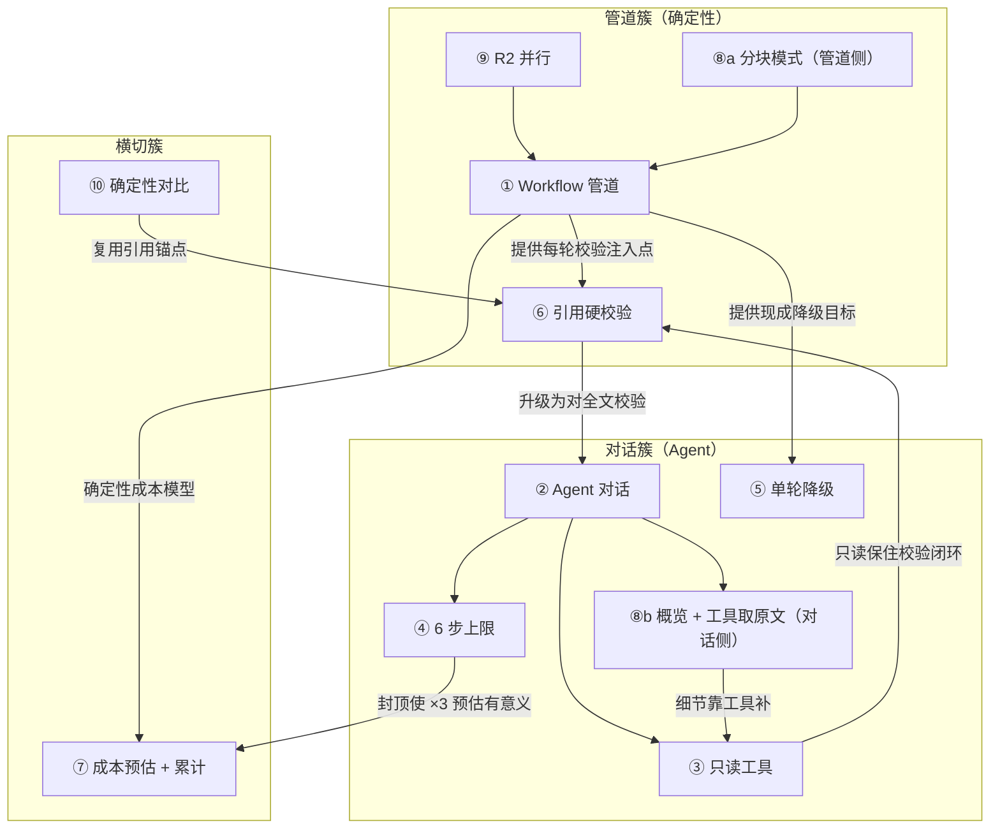

# Script Doctor 关键设计决策记录

> 生成日期：2026-09-15 ｜ 代码版本：Stage 3「剧本医生 Agent 化」完成后
> 阅读约定：**相关代码**与**最终选择**是事实（有代码佐证）；**如果重来**与**回应要点**是建议（我的视角）；**信心标注**是自我评估。行号均已与当前代码核对。
> 结构说明：「选择理由」按三层写——①直接理由 ②约束层（成本/延迟/可控性/防幻觉/可评测逐项过）③反证条件（什么证据出现我会改选）。面试被追问三层都能接住。

---

### 决策 1：分析管道用 Workflow 而不是 Agent

- **候选方案**：
  - A. 全自主 agent：模型自己决定分析什么、查什么、出什么
  - B. 确定性 Prompt 链：R1→R2→R3→R4 硬编码（**现状**）
  - C. Orchestrator 折中：workflow 骨架 + 模型决定「要不要深挖」（= roadmap 方案 B）
- **最终选择**：B，C 明确列为第二阶段
- **选择理由**：
  - ① 分析任务结构已知：7 个模块 × 全剧本，每轮输入输出 schema 固定，不存在「不可预枚举的下一步」，动态决策纯属浪费
  - ② 约束层——**成本**：10 次调用精确可估（每模块输出 token 经验常数 analyzer.py:54-56），agent 的成本上不封顶没法报价；**延迟**：R2 七模块并行把墙钟时间压到 ≈1 次调用（见决策 9）；**可控**：每轮独立 schema 校验，失败可定位到具体模块降级（`_run_module` analyzer.py:268），agent 失败面不可枚举；**防幻觉**：每轮输出都有引用硬校验注入点（analyzer.py:760-764 / :792 / :817），agent 路径上校验点难枚举；**可评测**：固定剧本跑固定模块可回归，agent 的探索路径组合爆炸
  - ③ 反证条件：出现「条件深挖」刚需（漏洞确认后自动读相关场次取证）或实测某模块对部分剧本纯浪费时，升级 C
- **放弃的代价**：不能条件深挖；每加一个分析维度要改代码 + 模板；对输入形态变化（小说 vs 分场剧本）不鲁棒
- **如果重来**：还会选 B。理由：MVP 要的是「演示稳 + 成本讲得清」，且 workflow 的每轮校验基建（schema 修复、引用校验）后来被 agent 层直接复用了，架构债为负
- **相关代码**：analyzer.py:658 `run_pipeline`（顺序写死）、:749（并行）、:268 `_run_module`；llm.py:59 `complete`（管道侧从不传 tools）
- **信心**：✅ 这是我最有信心的（workflow/agent 边界是本项目最核心的架构判断）

---

### 决策 2：对话层用 Agent 而不是单轮 Q&A

- **候选方案**：
  - A. 保持单轮 `ask_doctor()`（analyzer.py:367），不给工具
  - B. 全量 agent 改造，删除单轮
  - C. agent 主路径 + 单轮降级（**现状**）
- **最终选择**：C
- **选择理由**：
  - ① 单轮模式下模型只能靠上下文记忆回答，「某句台词在哪一场」这类刚需问题必幻觉；agent 可先 `search_script` 查证再引用原文（doctor_agent.py:293-371）
  - ② 约束层——**防幻觉**：引用校验升级为对剧本全文（doctor_agent.py:368-370），长剧本经工具取原文后不受场头概览限制——这点单轮做不到，是 agent 化的决定性收益；**成本**：每问 2~6 次调用，用步数上限（决策 4）+ 结果截断（TOOL_RESULT_CAP=1200）+ 每步最多 3 工具（doctor_agent.py:25-26）封顶；**可控**：3 个工具全部本地执行（决策 3），最坏情况 = 多花几次调用；**可评测**：FakeAgentClient 脚本化打桩回归，46 项断言不发网络（tests/test_agent_chat.py）
  - ③ 反证条件：若真实用户问题评测显示单轮可答率 >80% 且无幻觉，则 agent 的 3 倍成本不成立，回退 A
- **放弃的代价**：每问成本 ×2~6；多轮 RTT 延迟；上下文随工具往返累积；双路径（agent + 降级）维护成本
- **如果重来**：方向不变，但会先做「20 条真实问题 × 单轮 vs agent」的对比评测用数据定案，而不是论证定案。这是作品集最亮的点——「分析管道是确定性工作流、对话是 agent」的边界判断，面试价值大于实现成本
- **相关代码**：doctor_agent.py:293 `run_doctor_agent`、:44 TOOLS；llm.py:106 `complete_with_tools`；app.py:885-895（接入 + 降级）
- **信心**：✅ 这是我最有信心的（方向层面；成本数值层面见决策 7 的标注）

---

### 决策 3：只给 3 个只读工具，不给写工具

- **候选方案**：
  - A. 0 工具（单轮）
  - B. 3 只读工具：search_script / get_scene / read_report_section（**现状**）
  - C. 加写工具（直接改剧本 / 改建议）
  - D. 加更多读工具（统计计算、跨报告对比等）
- **最终选择**：B
- **选择理由**：
  - ① 对话场景的问题类型就三类：查台词/情节 → search；看场次细节/取逐字原文 → get_scene；问报告结论 → read_report_section
  - ② 约束层——**防幻觉（决定性）**：工具返回全部由本地规则检索生成、不经过 LLM（doctor_agent.py:117-191），模型收到的每一个字都真实存在；且只有只读才能保住「引用硬校验」闭环（quote 必须能回到 script_text 的子串，见决策 6）——**写工具会在这个闭环上凿洞**：模型可以改剧本后引用自己改的内容，校验形同虚设；**安全**：写剧本是不可回滚副作用 + 幻觉行动风险，MVP 不碰；**可控**：read_report_section 用枚举白名单（REPORT_SECTIONS doctor_agent.py:39-42），search 上限 6 条 ±40 字窗口（:27-28）
  - ③ 反证条件：产品定位转向「AI 直接改稿」时才考虑写工具，且必须先加 dry-run 预览 + 用户确认防线
- **放弃的代价**：模型不能给「可直接落地的改后句子」（只能回答 + 指路）；工具能力天花板 = 本地规则能检索什么
- **如果重来**：不变。只读 3 件套是「能力与风险」的最小正交集；真要做写能力，先做半自动的「建议 diff 预览」而不是开放写工具
- **相关代码**：doctor_agent.py:44-91（TOOLS 定义）、:39-42（章节白名单）、:168-191（本地执行）、:190（未知工具拒绝）
- **信心**：✅ 这是我最有信心的（「只读」是防幻觉体系的承重墙）

---

### 决策 4：Agent loop 上限 6 步

- **候选方案**：
  - A. 不设上限，让模型自己停
  - B. 固定 6 步，最后一步不执行工具留给收尾（**现状**）
  - C. 更紧的 3 步
  - D. 按问题类型动态分配
- **最终选择**：B
- **选择理由**：
  - ① 单问成本封顶 = 6 工具轮 + 1 收尾 = 7 次调用；杜绝「查了又查」死循环
  - ② 约束层——**成本**：不设上限则最坏情况不可控，且成本预估（×3 步）失去意义；**延迟**：每步一次 RTT，6 步是交互可容忍上限；**可控**：第 6 步即使模型还在调工具也强制丢弃、直接收尾（doctor_agent.py:339-342），保证「必有回答」；6 的依据是经验推算：典型查证 = 搜索关键词 → 读场次 → 补一次搜索 = 3 步，6 给了 2 倍余量
  - ③ 反证条件：**这个数字是拍的**（见信心标注）。用真实问题集跑「无上限版本」采步数分布：P95 > 6 说明太紧伤答案质量，P95 ≤ 3 说明可降到 4 省成本
- **放弃的代价**：步数用尽时被迫收尾，复杂问题（跨 5+ 场取证）答案质量下降；6 步 × 每步 3 工具的理论最坏成本仍不低
- **如果重来**：数字重新定（先采集分布再设值），但「上限 + 末步强制收尾」这个结构保留——它是 agent 可预期性的来源
- **相关代码**：doctor_agent.py:23（MAX_AGENT_STEPS=6）、:339-342（末步不执行工具）、:25-26（每步 3 工具 × 1200 字截断，配套成本控制）
- **信心**：⚠️ 这是我最不确定的（结构对、数字拍——和决策 7、8 共享「缺真实用量数据」这个根源）

---

### 决策 5：保留旧 ask_doctor() 作为降级

- **候选方案**：
  - A. agent 失败直接报错，让用户重试
  - B. 失败后无工具重试一次
  - C. 降级单轮 `ask_doctor()` + note 说明（**现状**）
- **最终选择**：C
- **选择理由**：
  - ① agent 比单轮多了工具循环 + 收尾两段，故障面更大；降级保证「对话功能永远可用」
  - ② 约束层——**体验**：用户问的是问题，不该为架构故障买单；**成本**：降级路径 1 次调用，比重试 agent 便宜；**可控**：失败原因写进 note 并展示（app.py:895「[剧本医生Agent] 异常，降级单轮」），用户看得见发生了什么；**实现成本**：ask_doctor 本来就在（analyzer.py:367），边际成本 ≈ 0
  - ③ 反证条件：降级率实测 >5% 说明 agent 实现有 bug，应修 agent 而非靠降级；若产品要求「宁可无答不可错答」的质量红线，则改 A/B
- **放弃的代价**：降级回答回到单轮口径（无全文引用校验增强），质量回退；agent + 降级双路径都要维护测试
- **如果重来**：不变。graceful degradation 是标准做法；会补一件事——给降级触发打点，线上看降级率
- **相关代码**：analyzer.py:367 `ask_doctor`；doctor_agent.py:326-332（异常 → 返回 None）；app.py:895（降级 + note）
- **信心**：✅ 这是我最有信心的（标准 failover，实现成本几乎为零）

---

### 决策 6：引用校验用硬校验（_filter_quotes）而不是让模型自检

- **候选方案**：
  - A. 不校验，信任模型
  - B. prompt 里要求模型自检（「请确保引用原文」）
  - C. 逐字硬校验：去空白子串匹配，对不上的引用剔除 + 警告（**现状**）
- **最终选择**：C
- **选择理由**：
  - ① 模型自检 = 让幻觉源自查，没有任何强制力，幻觉时它会连「自检」一起演；硬校验是不可骗的规则层
  - ② 约束层——**防幻觉（决定性）**：`flat = re.sub(r"\s+","",script_text)` 后逐字子串匹配（analyzer.py:241 `_filter_quotes`），模型要编一条恰好混进全文的引用几乎不可能；**可评测**：校验无 LLM 成本、行为确定，纯函数单测可断言（测试断言「未命中全文的引用被剔除」）；**产品信任**：「引用逐字可验」是给编剧用户的核心信任点，比置信度锚点（prompts.py 0.3/0.5/0.7/0.9 档）更硬；**失败处理设计**：剔除而非阻断——答案保留、假引用丢掉、warnings 记录，宁少勿假
  - ③ 反证条件：盲点（截断误杀、同义改写误杀、≤40 字限制）导致实测引用保留率 <60% 时，说明模型引用习惯与校验不兼容，加「宽松匹配（编辑距离）+ 标注」二档
- **放弃的代价**：被模型改写过的引用被误杀（宁可错杀不可漏放）；无法校验对报告内部结论的引用（只对剧本全文）；逐字约束让引用偏短
- **如果重来**：不变，且这是全项目最得意的设计之一。唯一会改：被剔除的引用在 UI 留痕（「N 条引用未通过校验被剔除」），现在只在 warnings 里
- **相关代码**：analyzer.py:241-261 `_filter_quotes`；调用点 analyzer.py:760-764（R2 各模块）、:792（R3）、:817（R4 改写 original 复用同一校验）；doctor_agent.py:368-370（agent 模式对全文）；QUOTE schema prompts.py:14
- **信心**：✅ 这是我最有信心的（它是「防幻觉」故事的地基，其余校验层都站在它旁边）

---

### 决策 7：成本展示用「先预估、后按实际累计」

- **候选方案**：
  - A. 不展示成本
  - B. 只展示预估
  - C. 只展示实际累计
  - D. 预估 + 实际累计（**现状**）
- **最终选择**：D
- **选择理由**：
  - ① 每次分析都要花钱，PM 产品要让用户「消费前有预期、消费后有对账」
  - ② 约束层——**成本透明**：上传页预估纯本地计算、不调 LLM（`estimate_run_cost` analyzer.py:65）；**诚实**：口径保守（1 字 ≈ 1 token，EST_CHARS_PER_TOKEN=1.0 analyzer.py:61）且明示「闲时价，实际以账单为准」；**agent 方差**：单问 2~6 调用不可预知，先显示 ×3 步预估（AGENT_EST_STEPS=3 doctor_agent.py:29），回答后按实际 usage 覆盖累计（app.py:907-911）；**体验**：预估在点击前（决策门槛），累计在对话区常驻（「已调用 N 次」）
  - ③ 反证条件：×3 步是拍的（见信心标注）。实测每问平均步数出来后回填常量；若用户反馈「预估被实际覆盖」造成困惑，改只累计
- **放弃的代价**：预估可能显著偏离实际（尤其 agent），有「误导消费」风险；预估 + 累计两个数字并存，信息密度高
- **如果重来**：展示模式不变；但 AGENT_EST_STEPS 会先用真实数据校准再上线——现在是 3，实际 2~6，这是当前最该补的实测数据
- **相关代码**：analyzer.py:53-62（预估常量表）、:65 `estimate_run_cost`；doctor_agent.py:29、:374-389 `estimate_agent_cost`；app.py:846（预估展示）、:398-399（累计初始化）、:907-911（实际累计）
- **信心**：⚠️ 这是我最不确定的（展示模式对、乘数拍的——乘数是面向用户的钱数，最该校准的就是它）

---

### 决策 8：上下文口径——≤2 万字全量，更长用场头概览

- **候选方案**：
  - A. 一律全量（超长截断尾部）
  - B. 一律分块 + 合并
  - C. ≤2 万全量；管道侧更长走分块模式，对话侧更长走场头概览 + 工具按需取原文（**现状**）
  - D. RAG 向量检索
- **最终选择**：C
- **选择理由**：
  - ① 2 万字内全量 = 模型看得见每个字，长线逻辑/伏笔检测最强——这也是产品定位「电影短片/单集剧本」的依据（README 已声明）
  - ② 约束层——**成本**：全量 2 万字 ≈ 2 万+ token/次 × 10 次调用，再长成本线性爆，RAG 的基建成本对 MVP 过重；**管道侧质量**：分块模式每块 12 场重叠 1 场（analyzer.py:32-33）保块边界连续性，L3 用 MERGE_TEMPLATE 汇总（prompts.py:843）；**对话侧防幻觉**：概览只影响模型的「第一印象」，引用校验对全文做（doctor_agent.py:368-370），模型答错判断时引用兜不住——这是已知边界；**可评测**：阈值是标量，一行可改
  - ③ 反证条件：2 万是拍的（见信心标注）。需要真实用户剧本长度分布定阈值；若 >30% 用户超 2 万字且投诉分块质量，跨块长线检测弱就从「已知限制」变成真问题，届时升 RAG 或更长上下文模型
- **放弃的代价**：分块模式跨块长线逻辑检测有限；概览模式下模型对细节的判断可能错（引用被校验兜住，判断不被兜住）；无语义检索（同义词查不到，search_script 是子串匹配）
- **如果重来**：结构保留，阈值用数据定；会补「搜索语义扩展」填 RAG 缺口（同义词/近义表达召回）
- **相关代码**：analyzer.py:31-33（CHUNK_THRESHOLD_CHARS=20000 / CHUNK_MAX_SCENES=12 / CHUNK_OVERLAP_SCENES=1）、:688（分块判定）、:529 `_run_chunked`、:207 `scene_overview`、:337 `chat_context_text`
- **信心**：⚠️ 这是我最不确定的（阈值拍的、概览口径牺牲了模型判断质量——代价真实存在，只是被引用校验部分遮住）

---

### 决策 9：分析模块并行执行（R2）

- **候选方案**：
  - A. 7 模块串行
  - B. 全并行，ThreadPoolExecutor(max_workers=6)（**现状**）
  - C. 模型一次调用出全部模块 JSON
- **最终选择**：B
- **选择理由**：
  - ① 7 个模块无相互依赖（都只依赖剧本 + stats），串行是纯浪费墙钟时间
  - ② 约束层——**延迟**：7 次串行 RTT ≈ 7T，并行 ≈ 1T，70~140 秒总时长的感知主要由此决定；**成本**：并行不省 token 但省等待，价格不变体验翻倍；**可控**：单模块失败不影响其余（线程各自返回，失败模块降级 `clean[module]=None` analyzer.py:764）；**限流**：max_workers=6 是「7 个模块」与「温和并发」的折中，给服务端限流留余量；**可评测**：模块 schema 契约不变，并行只是调度层，单测不受影响
  - ③ 反证条件：出现模块间依赖（漏洞结论驱动节奏深挖）时纯并行失效，改 DAG 调度——这正是 roadmap 方案 B 的升级路径
- **放弃的代价**：无法做「上游结论指导下游」的深挖；并发峰值比串行高 6 倍，限流风险上移
- **如果重来**：不变。并行是确定性 workflow 的最大红利之一，且线程池天然可升级为依赖图（DAG），给方案 B 留好了路
- **相关代码**：analyzer.py:749-759（ThreadPoolExecutor + as_completed + 进度回调）；模块无依赖从 `_one()` 签名可见（analyzer.py:741-746，只吃 ctx 不吃兄弟模块结果）
- **信心**：✅ 这是我最有信心的（无依赖任务是并行教科书场景）

---

### 决策 10：改稿对比模式保持确定性

- **候选方案**：
  - A. 用 LLM 对比两份报告
  - B. 纯规则对齐（**现状**）；其中「建议是否采纳」是 LLM 判的，但用引用锚点 + 约束钉住
  - C. 只对比总分不对比漏洞
- **最终选择**：B
- **选择理由**：
  - ① 对比的本质是「两份报告的漏洞是否同一处」——引用原文就是天然主键，规则对齐（open/gone/unknown/new_in_v2，compare.py:28）零成本零幻觉
  - ② 约束层——**防幻觉**：LLM 对比会脑补两版差异，规则对齐对不上就诚实标 unknown；**成本**：对比页随便点，0 调用；**可评测**：纯函数可单测；**可控**：采纳判定是唯一 LLM 环节，但被三重约束钉住——QUOTE 证据、adopted 布尔必填（prompts.py:583-590）、「未采纳必须写明可执行的还差哪一步」（analyzer.py:126）；**演示稳定性**：闭环指标（68→78、漏洞 2→0、采纳 3/3）硬编码（app.py:977-981），面试演示零故障
  - ③ 反证条件：unknown 占比高（改稿动了原文导致引用对不上）时规则对齐价值下降，加「LLM 重锚定」二档兜底——增强，不是替换
- **放弃的代价**：引用被改动过的漏洞掉进 unknown，对比偏保守；无法对比「引用之外」的变化（如整体节奏变好）
- **如果重来**：不变。但必须诚实：演示页闭环数字是硬编码的（app.py:977-981），面试被问「v2 是不是真跑出来的」要如实答——对应 ARCHITECTURE_SUMMARY.md §7 待确认项 1、2
- **相关代码**：compare.py:28 `match_holes`；analyzer.py:107-128 `_build_review_block`、:126（还差哪一步）、:774（prev 注入 R3）；app.py:977-981（演示硬编码指标）
- **信心**：✅ 这是我最有信心的（对比 = 主键对齐，规则层是天然正确解；但「演示指标硬编码」这条要主动坦白）

---

## 决策之间的关系图

**强耦合（抽掉任何一个都会塌）**：
- **②↔③↔⑥ 三角**：agent 的价值核心是「查证 + 硬校验」闭环——只读工具（③）保证工具返回真实、硬校验（⑥）保证引用真实，缺任何一个，agent 的防幻觉主张都不成立。
- **①↔⑥**：管道的每轮输出都靠硬校验钉住，若换 agent 管道（推翻①），⑥的注入点结构要重设计。

**可独立改变（不动其他决策）**：
- **⑦ 成本展示**：纯 UI 层，换展示模式/校准乘数不碰任何架构。
- **⑩ 对比**：功能整体独立于对话，可单独下掉或增强（加 LLM 重锚定二档），不影响 agent。
- **⑨ 并行**：调 max_workers 一行事，未来升级 DAG 也只在管道内部。
- **④ 步数**：改一个常量，但会连带影响 ⑦ 的预估乘数（弱耦合）。

**共同根源**：④、⑦、⑧ 三个「最不确定」决策共享同一个根源——**缺真实用量数据**（步数分布、每问平均步数、用户剧本长度分布），三个数字都是拍的。上线后第一批实测数据应该一次性校准这三个常量。

---

## 如果面试官挑战这个决策，我的回应要点

| 决策 | 可能的挑战 | 回应要点 |
|---|---|---|
| ① Workflow 管道 | 「2026 年了为什么不用 agent 做分析？」 | 分析任务结构已知、无动态决策需求；workflow 换来的是成本可报价、每轮可独立校验、模块可并行——这三个都是 agent 给不了的；且 agent 化对话层后，「管道确定性 + 对话灵活性」的组合恰好是分场景选架构的例子 |
| ② Agent 对话 | 「多轮调用成本翻 3 倍值吗？」 | 单轮回答「台词在哪场」必幻觉，引用校验对全文是决定性收益；成本有步数上限 + 截断封顶；且对话是作品集的差异化亮点，面试价值 > 成本 |
| ③ 只读工具 | 「不给写工具，产品怎么做 AI 改稿？」 | 写工具会凿穿引用硬校验闭环（模型可改剧本后引用自己的改动），MVP 阶段风险收益不成比例；真要做写能力，先做「建议 diff 预览 + 用户确认」的半自动，不做开放写 |
| ④ 6 步上限 | 「6 是拍的吧？」 | 是，如实承认；但「上限 + 末步强制收尾」的结构是必要的成本封顶，数字用真实问题集跑无上限版本采分布后校准 |
| ⑤ 单轮降级 | 「降级了回答质量不就回退了吗？」 | 降级只在 agent 故障时触发（目标 <5%），是「宁可质量回退不可功能不可用」的取舍；失败原因透明展示在 UI，用户可以自己判断重问 |
| ⑥ 引用硬校验 | 「逐字匹配会不会误杀好引用？」 | 会，这是「宁可错杀不可漏放」的明确取舍——漏放 = 产品信任崩塌，误杀 = 少一条引用；模型只需按「逐字抄工具返回」的规则写（prompt 已明确约束），误杀率可控 |
| ⑦ 预估 + 累计 | 「预估不准不是误导吗？」 | 口径保守（1 字 ≈ 1 token）+ 明示「闲时价、以账单为准」+ 实际累计覆盖预估；三个「最不确定」决策之一，承认乘数待实测校准 |
| ⑧ 2 万字阈值 | 「为什么不是 RAG？」 | 产品定位收敛到「电影短片/单集剧本」≈2 万字，RAG 基建成本对 MVP 过重；分块模式的跨块长线检测弱是已知限制（README 声明）；阈值用用户数据定 |
| ⑨ R2 并行 | 「6 并发不怕限流吗？」 | max_workers=6 是温和并发（<7 模块数），给服务端留余量；触发 429 时降 workers 或加退避是一行改动 |
| ⑩ 确定性对比 | 「unknown 太多怎么办？」 | 引用对不上就诚实标 unknown，绝不脑补——这是防幻觉原则在对比页的延续；unknown 占比高时加「LLM 重锚定」二档兜底（增强不替换）；另需主动坦白演示指标是硬编码的 |

---

## 一页纸总结（面试速览）

1. **架构判断**：管道确定性（成本/校验/并行）+ 对话 agent 化（查证/引用）+ 校验层横切（schema/硬校验/规则）——分场景选架构，而非一刀切。
2. **防幻觉体系**（可串成一条完整故事）：json schema 校验+修复重试 → 引用逐字硬校验 → 规则统计（出场场次不让 LLM 数）→ 规则硬检查（0 LLM 成本）→ 置信度锚点 → 采纳判定「还差哪一步」。**其中纯规则层（硬校验/硬检查/对比）完全不可骗，是产品信任的地基。**
3. **三个诚实的不确定**：6 步上限、×3 成本乘数、2 万字阈值——都是拍的，根源是缺真实用量数据，上线后第一批实测一次性校准。
4. **两个主动坦白**：演示闭环指标硬编码（app.py:977-981）、演示报告非当前示例剧本在线生成——被问到如实说，反而显得严谨。
