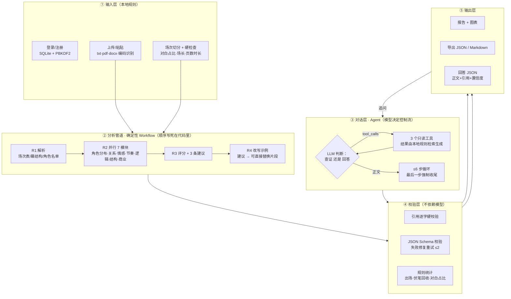

# Script Doctor（剧本医生）

一个剧本体检与对话查证工具。上传剧本（txt / pdf / docx），约 1–2 分钟得到一份七维体检报告和 3 条可落笔的修改建议；报告里的任何结论都能继续追问，回答中的每句台词引用都逐字核对过原文——查不到就明说查不到。

定位：电影短片 / 电视剧单集剧本（≤2 万字）。评分为 AI 参考意见，非行业标准评价。

## 功能特性

按使用流程排序：

| # | 功能 | 输入 → 输出 | 解决什么问题 |
|---|---|---|---|
| 1 | 上传 / 粘贴剧本 | txt / pdf / docx，自动识别 UTF-8 / GBK 编码 | 不用整理格式 |
| 2 | 免费规则硬检查 | 剧本 → 对白占比、每场字数分布、页数↔时长换算（本地计算，0 次 LLM 调用） | 先拿到客观统计，再决定是否花 AI 的钱 |
| 3 | 模块勾选 + 成本预估 | 勾选 7 个 AI 模块 → 实时显示调用次数与预估费用 | 花多少钱，事前知道 |
| 4 | 剧本分析（确定性管道） | 剧本 → 七维报告（角色分布 / 关系、情感曲线、节奏、逻辑漏洞、结构、商业潜力） | 比人工反馈快，比通用 AI 具体（每个结论落到场次） |
| 5 | 图表报告 | 报告 JSON → 6 维评分雷达图、出场柱状图、情感折线、节奏张力图、角色关系网络图、三幕结构图 | 长报告一眼看懂 |
| 6 | 修改建议 + 改写示例 | 报告 → 3 条建议（落到具体场次）+ 每条附可直接替换的改写片段 | 知道「改成什么样」，而不是「你再想想」 |
| 7 | 追问（对话 Agent） | 提问 → 回答 JSON（正文 + 逐字引用 + 置信度），查证步骤实时可见 | 通用 AI 会编台词；这里查证后再说，查不到明说 |
| 8 | 改稿闭环 | 改后剧本再分析 → 上一版建议逐条采纳判定 + 两版对比 | 验证建议真的被用上 |
| 9 | 历史与导出 | 报告 → JSON / Markdown 导出，任选两版历史对比 | 存档与复盘 |
| 10 | 离线演示 | 内置示例剧本 + 预计算报告，无需 API Key | 演示、面试零故障 |

## 架构说明

分层架构：



**为什么这样分工**：分析任务的结构是已知的——七个固定维度 × 全文，没有「不可预枚举的下一步」。用确定性流程换来三样东西：单次成本精确可预估（¥0.4–2.4，上传前展示）、7 个模块并行（耗时约为串行的 1/7）、每个环节独立校验、失败可定位降级。追问的问题不可预枚举（「这句台词在哪场」「这个漏洞成立吗」），必须让模型自己决定查什么，所以对话层用 Agent——但限死在 6 步、3 个只读工具内，成本与风险可控。

**代价如实说**：Agent 每问约 2–6 次 LLM 调用，约为单轮的 3 倍；单轮问答凭记忆必编造，这是它只被保留为降级路径、而不是主路径的原因。

## 核心设计决策

| # | 决策 | 为什么 | 放弃了什么 |
|---|---|---|---|
| 1 | 分析管道用确定性 Workflow，不用 Agent | 任务结构已知；成本可报价、模块可并行、校验点可埋 | 动态深挖（发现漏洞后自动取证）——列入第二阶段路线图，等数据证明部分模块对部分剧本是浪费再上 |
| 2 | 工具只给 3 个，且全部只读 | 追问的问题类型就三类：查台词 / 看场次 / 问报告结论。只读是防幻觉的承重墙——工具结果全部由本地规则检索生成，模型收到的每个字都真实存在；一旦给写工具，模型可以改完剧本再引用自己改的内容，逐字校验形同虚设 | 让 AI 直接改剧本（改写由管道内 R4 完成，那里有完整校验） |
| 3 | 引用逐字硬校验，宁可错杀 | 一条假引用 = 编剧对整个工具失去信任。对不上原文的引用直接剔除（保留回答、去掉假证据） | 可能误删个别改写过的引用——用「引用误杀率」指标监控，目标 <20% |
| 4 | 保留单轮 Q&A 作为降级路径 | Agent 循环调用失败或校验修复重试耗尽时，自动降级单轮问答，保证用户永远能得到一个回答 | 一致性——同一问题两条路径质量不同，这是下一步「问题分类路由」要解决的 |

## 工具说明

Agent 可调用的 3 个工具，全部只读：

| 工具 | 用途 | 输入 | 输出 | 失败处理 |
|---|---|---|---|---|
| `search_script` | 在剧本原文搜索关键词，核实某句台词/情节是否存在及其场次 | `keyword`（字符串） | `found` + `hits`（≤6 条，每条带 ±40 字上下文） | 关键词为空 / 未命中 → `found=0` + note，不抛异常 |
| `get_scene` | 读取指定场次的完整原文（回答场次细节、为引用取逐字原文） | `scene`（整数） | 该场标题 + 原文（≤1200 字） | 场次不存在 → `ok=False` + error（注明剧本共几场） |
| `read_report_section` | 读取体检报告的指定章节，结合报告结论回答 | `section`（11 个白名单键的枚举，防任意键读取） | 章节 JSON（≤1200 字） | 章节缺失 → `found=False` + note（可能本次未分析该模块） |

通用规则：工具参数不是合法 JSON、或未知工具名，返回 `ok=False` + error；单步最多执行 3 个工具；所有工具结果回喂时截断到 1200 字符，控制输入成本。

## 安装与使用

**环境要求**：Python 3.10+（建议 3.11）。

```powershell
cd script-doctor
python -m venv .venv
.venv\Scripts\Activate.ps1
pip install -r requirements.txt
```

**配置**：API Key 从环境变量 `DEEPSEEK_API_KEY` 读取（或在项目目录建 `.env` 文件写入 `DEEPSEEK_API_KEY=sk-...`）。可选 `DEEPSEEK_MODEL` 指定模型，默认 `deepseek-v4-pro`。

```powershell
streamlit run app.py
```

浏览器打开 `http://localhost:8501`，注册账号或游客进入（游客可用离线演示，在线分析需注册）。

**最小示例**：粘贴下面这段剧本，点「开始分析」：

```
第1场 深夜便利店
林远走进便利店，对店员说：我要一包烟。
第2场 天台
林远想起母亲的遗言：别回头。他决定自首。
```

约 70–140 秒（4 轮 10 次 LLM 调用）得到完整报告；在报告底部追问「主角的动机在哪一场立起来」，观察查证步骤（搜索原文 → 读取场次 → 逐字校验引用）。

**没有 API Key 也能试**：上传页 →「示例剧本」→「一键离线演示报告」；或全不勾选 AI 模块，得到一份纯本地计算的免费硬检查报告。

**单次成本**：¥0.4–2.4（按 DeepSeek 官方闲时价粗估，以实际账单为准）。

## 评估

**现状：机制已验证，效果待测。**

已验证（机制层）：
- `tests/` 下 8 个测试套件、340 项断言全部通过——含「编造引用被剔除」的专项用例
- 引用逐字硬校验、Schema 修复重试、Agent 步数上限与强制收尾、异常降级，均有回归测试覆盖

待测（效果层，方案见 `EVALUATION_PLAN.md`，**尚未运行**）：
- **评估集**：12 个任务，5 类（原文核实 5 / 跨场查证 2 / 报告与原文冲突 2 / 查无此信息 2 / 越权拦截 1+5 变体）
- **A/B 设计**：Agent（`doctor_agent.run_doctor_agent`）vs 单轮 Q&A（`analyzer.ask_doctor`），同一批任务、每任务跑 3 次取中位数、盲评
- **指标**：任务完成率、引用准确率、引用误杀率、平均工具步数、端到端延迟、单次成本、转人工率、越权拦截率（方案表中的基线/目标均为假设值）
- **判定阈值**：完成率优势 ≥10pp 且引用准确率优势 ≥20pp，Agent 的成本才值得

## 已知限制与下一步

**已知限制**：
1. 评分、情感值、张力值是模型主观判断，仅作创作参考
2. 商业潜力模块无市场数据支撑，置信度上限 0.5
3. 分块模式（>2 万字）对跨块长线逻辑的检测能力有限
4. PDF 扫描件（无文本层）无法解析，需先转 txt
5. 对话不持久（刷新即失）；历史报告未存全文，不能对历史报告追问
6. 剧本原文会发送给 DeepSeek API，数据条款未做合规审查——商业化前必做项

**下一步优先级**：
1. **跑效果评估**（12 任务 A/B）——所有后续优化决策的地基
2. **问题分类路由**——摘要类走单轮、核实类走 Agent，预期省掉约 2/3 的对话成本
3. **真实用户试用**（5–10 人）——验证定位，收集真实反馈
4. **条件深挖**（orchestrator 动态调度分析）——等数据证明部分模块对部分剧本是浪费再上
5. **合规审查**——商业化前必做

## 项目结构

```
script-doctor/
├── app.py            # Streamlit 前端：登录/上传/报告/历史/对比/对话
├── analyzer.py       # 分析管道编排：切场/分块/校验/防幻觉/成本预估
├── prompts.py        # Prompt 模板 + JSON Schema（全模块）
├── doctor_agent.py   # 对话 Agent：3 只读工具 + ≤6 步查证循环 + 引用硬校验
├── llm.py            # LLM 适配层：DeepSeek（OpenAI 兼容）；切换供应商只改本文件
├── hardcheck.py      # 免费规则硬检查（本地计算，0 次 LLM 调用）
├── charts.py         # 报告图表构建（纯函数，可单测）
├── auth.py           # 用户系统：SQLite + PBKDF2 加盐哈希
├── history.py        # 分析历史存取（与 users.db 同库）
├── compare.py        # 改稿对比：漏洞引用锚点对齐（纯规则）
├── tests/            # 8 个测试套件，340 项断言
├── demo_script(_v2).txt   # 内置示例剧本（离线演示 / 改稿闭环）
├── demo_report(_v2).json  # 预计算示例报告
├── AGENT_DESIGN.md   # Agent 设计方案
├── ARCHITECTURE_SUMMARY.md  # 架构说明（含文件:行号出处）
├── DECISIONS.md      # 决策记录（含最不确定决策清单）
├── EVALUATION_PLAN.md # 效果评估方案（12 任务 A/B，待跑）
└── requirements.txt
```

## 贡献指南

- **Issue**：功能建议、bug 报告欢迎提交到 [GitHub Issues](https://github.com/XYG522/script-doctor/issues)
- **跑测试**（提交 PR 前必跑全部 8 个套件）：
  ```powershell
  py tests/test_agent_chat.py
  py tests/test_auth_flow.py
  # …其余 6 个套件逐个运行，或一次性：
  Get-ChildItem tests\test_*.py | ForEach-Object { py $_.FullName }
  ```


